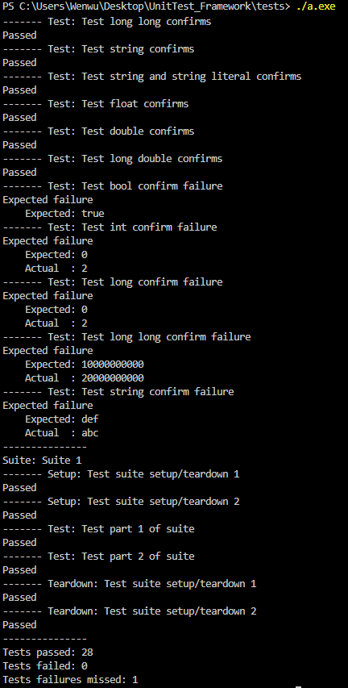

  <h1 align="center">Тестовый фреймворк MereTDD</h1>
  
  

    По книге "Test-Driven Development with C++" — Abdul Wahid Tanner (2022)
  

  
  

    
  

  <h2>Требования</h2>
  
  <ul>
    <li><strong>C++ Standard:</strong> C++20</li>
    <li><strong>GCC:</strong> 10+ / <strong>Clang:</strong> 12+ / <strong>MSVC:</strong> 2019+</li>
  </ul>
  
  <blockquote>
    Внимание: Фреймворк использует возможности C++20: std::source_location и метод contains() для контейнеров.
  </blockquote>

  <h2>Сборка и запуск</h2>
  
  
<strong>1. Перейдите в директорию с тестами:</strong>

  
  <pre><code>cd tests</code></pre>
  
  
<strong>2. Скомпилируйте проект:</strong>

  
  <pre><code>g++ -std=c++20 Confirm.cpp Creation.cpp main.cpp Setup.cpp -o tests</code></pre>
  
  
<strong>3. Запустите тесты:</strong>

  
  <pre><code>./tests</code></pre>

  <h2>Структура проекта</h2>
  
  <pre>
  tests/
  ├── Confirm.cpp      # Проверки утверждений
  ├── Creation.cpp     # Создание тестов
  ├── Setup.cpp        # Настройка окружения
  ├── main.cpp         # Точка входа
  └── ../Test.h        # Основной заголовочный файл
  </pre>

  <h2>Типичные ошибки и их решение</h2>
  
  
<strong>Ошибка: 'source_location' not declared</strong>

  
  <pre><code># Проблема: используется стандарт ниже C++20
  # Решение: добавьте флаг -std=c++20
  g++ -std=c++20 Confirm.cpp Creation.cpp main.cpp Setup.cpp</code></pre>
  
  
<strong>Ошибка: 'contains' is not a member of 'std::map'</strong>

  
  <pre><code># Проблема: метод contains() появился только в C++20
  # Решение: используйте C++20 или замените contains() на find()
  if(map.find(key) == map.end())  // вместо map.contains(key)</code></pre>

  <h2>Пример использования</h2>
  
  <pre><code>#include "Test.h"
    
  TEST(MyFirstTest)
  {
      confirm(42, 40 + 2);      // пройден
      confirm("Hello", "Hello"); // пройден
  }
  
  TEST(MySecondTest)
  {
      double result = 10.0 / 3.0;
      confirm(3.33333, result, 0.0001); // сравнение с погрешностью
  }
  
  RUN_TESTS();</code></pre>
